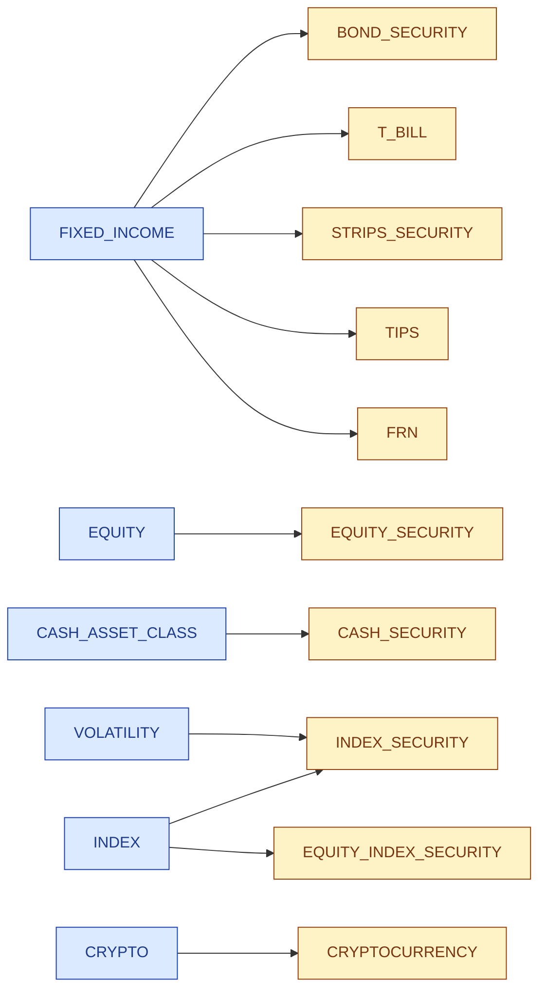
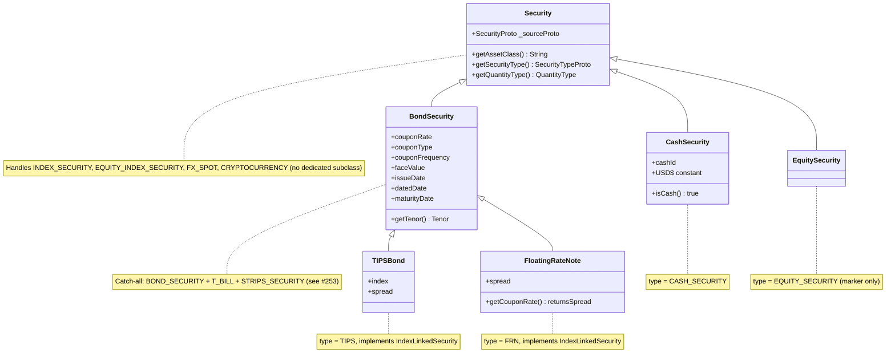
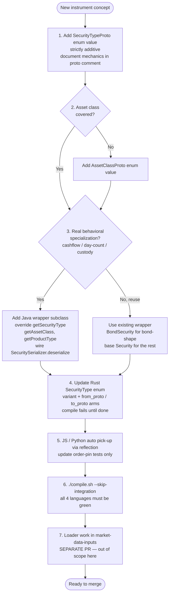

# Product Hierarchy

Reference doc — what a "security" is on the FinTekkers platform, how its taxonomy is encoded across protos and wrapper classes, and how a new instrument type slots in.

This is a **descriptive** document of the current state on `main`. Architectural concerns flagged inline should be read against the open redesign tracked in [second-brain#253](https://github.com/FinTekkers/second-brain/issues/253).

---

## 1. Asset class

`AssetClassProto` is the **canonical vocabulary** for the asset class of a security. Source: [`fintekkers/models/security/asset_class.proto`](../ledger-models-protos/fintekkers/models/security/asset_class.proto).

| Value | # | Meaning |
| --- | --- | --- |
| `UNKNOWN_ASSET_CLASS` | 0 | Sentinel — proto default for unset. |
| `FIXED_INCOME` | 1 | Bonds, notes, bills, STRIPS, FRNs, TIPS — anything with bond-shape mechanics. |
| `EQUITY` | 2 | Cash equity (common stock). |
| `CASH_ASSET_CLASS` | 3 | Currency holdings (USD, EUR, …). Suffixed `_ASSET_CLASS` because proto3 enforces package-wide enum-value uniqueness and `IdentifierTypeProto.CASH` already exists. |
| `INDEX` | 4 | Reference instruments (S&P 500, CMT-derived treasury indices). Borderline as an "asset class" in finance terminology; matches in-use data. |
| `VOLATILITY` | 5 | Volatility reference instruments (VIX, VVIX). Stored as `INDEX_SECURITY` at the type level but distinct asset class to differentiate from equity / fixed-income reference indices. Added in [#236](https://github.com/FinTekkers/second-brain/issues/236). |
| `CRYPTO` | 6 | Cryptocurrency holdings (BTC, ETH, …). Pairs with `SecurityTypeProto.CRYPTOCURRENCY`. Added in [#237](https://github.com/FinTekkers/second-brain/issues/237). |

### Enum vs field

`SecurityProto.asset_class` is currently a **`string`** field (security.proto field 11), not the typed enum. The enum is the canonical vocabulary; the field stays string in this release line to avoid coordinating a breaking change with ledger-service / valuation-service / market-data-inputs. A follow-up will flip the field type after a data-normalization audit. Producers should write the enum's symbolic name (`"Fixed Income"`, `"Equity"`, `"Cash"`, …) into the string field.

---

## 2. Security type

`SecurityTypeProto` identifies the **kind of instrument**. Source: [`fintekkers/models/security/security_type.proto`](../ledger-models-protos/fintekkers/models/security/security_type.proto).

| Value | # | Meaning | Asset class |
| --- | --- | --- | --- |
| `UNKNOWN_SECURITY_TYPE` | 0 | Sentinel — maps to base `Security` wrapper. | — |
| `CASH_SECURITY` | 1 | Currency unit (USD, EUR, …). | `CASH_ASSET_CLASS` |
| `EQUITY_SECURITY` | 2 | Cash equity (common stock). | `EQUITY` |
| `BOND_SECURITY` | 3 | Vanilla coupon-paying bond (Treasury Note/Bond, corporate). | `FIXED_INCOME` |
| `TIPS` | 4 | Treasury Inflation-Protected Security — fixed coupon on CPI-adjusted face value. | `FIXED_INCOME` |
| `FRN` | 5 | Floating-Rate Note — coupon = reference rate + spread, periodic reset. | `FIXED_INCOME` |
| `INDEX_SECURITY` | 6 | Reference index (CPI-U, CMT yields, etc.). Not a holdable instrument. | `INDEX` or `VOLATILITY` |
| `FX_SPOT` | 7 | Currency-pair quote (the on-the-wire name; consumers usually reason about it as "currency pair"). | — (legacy) |
| `EQUITY_INDEX_SECURITY` | 8 | Equity market index (DJIA, S&P 500, Nasdaq-100). Distinct from `INDEX_SECURITY` to allow downstream filtering. | `INDEX` |
| `STRIPS_SECURITY` | 9 | Principal-stripped Treasury component — single zero-coupon cashflow. Distinct from `BOND_SECURITY` because pricing/yield mechanics differ. Added in [#246](https://github.com/FinTekkers/second-brain/issues/246). | `FIXED_INCOME` |
| `T_BILL` | 10 | Treasury bill — short-tenor (≤1y), zero-coupon, ACT/360 discount-yield. First-class to avoid the `coupon_rate==0` heuristic. Added in [#246](https://github.com/FinTekkers/second-brain/issues/246). | `FIXED_INCOME` |
| `CRYPTOCURRENCY` | 11 | Bitcoin, Ethereum, etc. Identifier convention: `EXCH_TICKER='BTC-USD'` (with quote currency suffix). Added in [#237](https://github.com/FinTekkers/second-brain/issues/237). | `CRYPTO` |

### Asset class → Security type

Asset classes are 1-to-many over security types. Note `INDEX_SECURITY` is the proto type for both index reference instruments (CMT yields, CPI series) and volatility indices (VIX) — the asset class is what differentiates them.



`FX_SPOT` is omitted — it is a legacy currency-pair quote type with no clean asset-class mapping.

---

## 3. Product type

`ProductType` is a **Java-only** enum at [`common/models/security/ProductType.java`](../ledger-models-java/src/main/java/common/models/security/ProductType.java). It is **not a proto type** and is not part of the wire schema.

| Value | Meaning |
| --- | --- |
| `BILL` | Treasury Bill — derived from tenor (`<1y`) on `BondSecurity`. |
| `NOTE` | Treasury Note — derived from tenor (1–19y). |
| `BOND` | Treasury Bond — derived from tenor (`>19y`). |
| `TIPS` | Set explicitly by `TIPSBond`. |
| `FRN` | Set explicitly by `FloatingRateNote`. |
| `EQUITY` | Set explicitly by `EquitySecurity`. |
| `CASH` | Currency holding. |
| `UNCLASSIFIED` | Default. |

The class doc-comment is explicit: *"This should not be used for business purposes as code might be refactored."* It is a UI/display convenience derived from `security_type` + `tenor`, not an authoritative classification.

`ProductType.BILL`/`NOTE`/`BOND` predates the `T_BILL` proto enum value (added in [#246](https://github.com/FinTekkers/second-brain/issues/246)). The two are not yet reconciled — `BondSecurity.getProductType()` derives BILL/NOTE/BOND from tenor regardless of whether the underlying proto type is `BOND_SECURITY` or `T_BILL`. Tracked in [#253](https://github.com/FinTekkers/second-brain/issues/253).

---

## 4. Wrapper class hierarchy (Java)

```
Security                                    (base — common.models.security.Security)
├── BondSecurity                            (BOND_SECURITY; also T_BILL + STRIPS_SECURITY today)
│   ├── TIPSBond                            (TIPS — implements IndexLinkedSecurity)
│   └── FloatingRateNote                    (FRN — implements IndexLinkedSecurity)
├── CashSecurity                            (CASH_SECURITY)
└── EquitySecurity                          (EQUITY_SECURITY)
```



The `BondSecurity` catch-all for `T_BILL` and `STRIPS_SECURITY` is a known shape; whether it should split into per-type subclasses (each with its own pricing convention — ACT/360 discount-yield for bills, zero-coupon mechanics for STRIPS) is the subject of [second-brain#253](https://github.com/FinTekkers/second-brain/issues/253).

| Wrapper | File | Specialization beyond `Security` |
| --- | --- | --- |
| `Security` | [`Security.java`](../ledger-models-java/src/main/java/common/models/security/Security.java) | Base. Stashes `_sourceProto` for proto-first reads (`getAssetClass`, `getSecurityType`). `getQuantityType()` defaults to `UNITS`. `INDEX_SECURITY` / `EQUITY_INDEX_SECURITY` / `FX_SPOT` / `CRYPTOCURRENCY` deserialize to this base — no dedicated subclass. |
| `BondSecurity` | [`BondSecurity.java`](../ledger-models-java/src/main/java/common/models/security/BondSecurity.java) | Adds `coupon_rate`, `coupon_type`, `coupon_frequency`, `face_value`, `issue_date`, `dated_date`, `maturity_date`, `tenor`. `getQuantityType()` → `ORIGINAL_FACE_VALUE`. `getProductType()` derives BILL/NOTE/BOND from tenor. The catch-all wrapper for bond-shape proto types: also handles `T_BILL` and `STRIPS_SECURITY` via [`BondSerializer.initiatlize`](../ledger-models-java/src/main/java/protos/serializers/security/BondSerializer.java) (no specialized subclass yet). |
| `TIPSBond` | [`bonds/TIPSBond.java`](../ledger-models-java/src/main/java/common/models/security/bonds/TIPSBond.java) | Inflation-linked — implements `IndexLinkedSecurity`. Carries an `index` reference + `spread` field. CPI-adjusted face value is read from the proto's `tips_details` sub-message at deserialize time. |
| `FloatingRateNote` | [`bonds/FloatingRateNote.java`](../ledger-models-java/src/main/java/common/models/security/bonds/FloatingRateNote.java) | Floating coupon — implements `IndexLinkedSecurity`. `getCouponRate()` returns the spread (overrides parent). `couponType` = `FLOAT`. Reference rate / reset frequency read from `frn_details`. |
| `CashSecurity` | [`CashSecurity.java`](../ledger-models-java/src/main/java/common/models/security/CashSecurity.java) | `cashId` (e.g. `"USD"`). `isCash()` → `true`. Static `CashSecurity.USD` constant. |
| `EquitySecurity` | [`EquitySecurity.java`](../ledger-models-java/src/main/java/common/models/security/EquitySecurity.java) | Pure marker today — no equity-specific fields beyond what `Security` exposes. |

### Open architectural concern

`BondSecurity` is the catch-all for everything bond-shape (`BOND_SECURITY`, `T_BILL`, `STRIPS_SECURITY`). Since none of the latter have dedicated subclasses, deserialize → re-serialize was originally lossy on the type marker (the `getSecurityType()` override hardcoded `BOND_SECURITY`). Tracked + fixed in [PR #202](https://github.com/FinTekkers/ledger-models/pull/202) by making `BondSecurity.getSecurityType()` proto-first.

The broader question of whether `BondSecurity` should remain a catch-all, or whether T_BILL / STRIPS / Note / Bond should each have their own subclass with their own pricing conventions (ACT/360 discount-yield for bills, ACT/ACT for notes/bonds, zero-coupon mechanics for STRIPS), is the subject of [second-brain#253](https://github.com/FinTekkers/second-brain/issues/253).

---

## 5. Identifier types

`IdentifierTypeProto` describes the issuing scheme of an instrument identifier. Source: [`identifier/identifier_type.proto`](../ledger-models-protos/fintekkers/models/security/identifier/identifier_type.proto).

| Value | # | Meaning | Example |
| --- | --- | --- | --- |
| `UNKNOWN_IDENTIFIER_TYPE` | 0 | Sentinel. | — |
| `EXCH_TICKER` | 1 | Exchange ticker symbol. | `"AAPL"`, `"BTC-USD"` (crypto convention with quote-currency suffix) |
| `ISIN` | 2 | International Securities Identification Number (12-char). | `"US0378331005"` |
| `CUSIP` | 3 | Committee on Uniform Securities Identification Procedures (9-char US/Canada). | `"912828ZT0"` |
| `OSI` | 4 | Options Symbology Initiative — listed-options identifier. | `"AAPL  240119C00150000"` |
| `FIGI` | 5 | Financial Instrument Global Identifier (Bloomberg, 12-char). | `"BBG000B9XRY4"` |
| `SERIES_ID` | 6 | FRED series ID for reference-data instruments. | `"DGS10"` (10-yr CMT yield) |
| `CASH` | 50 | Currency code (numbered 50 to leave room before the gap). | `"USD"`, `"EUR"` |

---

## 6. How to add a new security type

Concrete checklist, against the precedents of [#246](https://github.com/FinTekkers/second-brain/issues/246) (T_BILL, STRIPS_SECURITY) and [#237](https://github.com/FinTekkers/second-brain/issues/237) (CRYPTOCURRENCY):

1. **Add the enum value.** Append to `SecurityTypeProto` in [`security_type.proto`](../ledger-models-protos/fintekkers/models/security/security_type.proto) with the next available number. Strictly additive — never renumber or rename. Add a documenting comment explaining what mechanics distinguish this type and what asset class it maps to.
2. **Decide on a wrapper class.** The bar is real behavioral specialization (cashflow logic, day-count override, custody fields, etc.). If the wire shape is the same as an existing wrapper and there's no specialized behavior yet, **don't add a subclass** — let the existing wrapper handle it (`BondSecurity` for bond-shape, `Security` base for index/reference). Empty wrappers are the wrong layer; the user-approved scope of [PR #200](https://github.com/FinTekkers/ledger-models/pull/200) explicitly dropped a `CryptoSecurity` wrapper for v1 BTC for this reason. Add the wrapper later, when consumers ask for behavior the base can't express.
3. **If a wrapper is added (Java),** override `getSecurityType()` to return the new type, override `getAssetClass()` if the asset class is fixed for this type, and update [`SecuritySerializer.deserialize`](../ledger-models-java/src/main/java/protos/serializers/security/SecuritySerializer.java) + [`BondSerializer.initiatlize`](../ledger-models-java/src/main/java/protos/serializers/security/BondSerializer.java) (or equivalent) to route the new type to the new wrapper.
4. **Update the Rust `SecurityType` wrapper enum.** Add a variant + `from_proto` / `to_proto` arms in [`security_type.rs`](../ledger-models-rust/fintekkers/wrappers/models/security_type.rs). The match is exhaustive over `SecurityTypeProto`; compile fails until updated.
5. **JS / Python wrappers** auto-pick-up the new enum name via reflection (`Object.keys(SecurityTypeProto)`) — no source change required, but **update the order-pin tests** (`security_type.test.ts`, `asset_class.test.ts`) so the new name appears in the expected list at the right index.
6. **Add asset class** if needed. Same rules as security type: append, document, don't rename.
7. **Run `./compile.sh --skip-integration`** end-to-end before opening the PR. All four languages must regenerate cleanly + pass tests.
8. **Loader work in [market-data-inputs](https://github.com/FinTekkers/market-data-inputs)** (for new instruments with external data sources) is a **separate dispatch** — out of scope for the ledger-models PR.

### Flow



Recent precedents:

- [#246](https://github.com/FinTekkers/second-brain/issues/246) — `T_BILL` + `STRIPS_SECURITY` added to `SecurityTypeProto` and **reused `BondSecurity`** (no new wrapper subclass). Wire-shape identical to a vanilla bond, no specialized behavior demanded yet.
- [#237](https://github.com/FinTekkers/second-brain/issues/237) — `CRYPTOCURRENCY` + `CRYPTO` asset class added; an empty `CryptoSecurity` wrapper was prototyped and then **dropped** during review on the principle that wrappers should earn their existence ([PR #200](https://github.com/FinTekkers/ledger-models/pull/200)). The base `Security` handles BTC for v1; a wrapper gets added when crypto-specific behavior (custody, on-chain refs) demands it.

---

## 7. Cross-language wrapper status

|  | Java | JS / TS | Rust | Python |
| --- | --- | --- | --- | --- |
| Style | Class-based subclass tree | Class-based + reflection helpers | Hand-written enum (proto-first) | Single class, proto-delegating |
| Base `Security` | ✅ | ✅ | ✅ | ✅ |
| `BondSecurity` | ✅ | ✅ ([`BondSecurity.ts`](../ledger-models-javascript/node/wrappers/models/security/BondSecurity.ts)) | ✅ ([`bond_security.rs`](../ledger-models-rust/fintekkers/wrappers/models/bond_security.rs)) | ❌ — base `Security` has bond-shape getters inline (`get_face_value`, `get_maturity_date`, `_get_bond_like_details`) |
| `TIPSBond` | ✅ | ❌ | ❌ | ❌ |
| `FloatingRateNote` | ✅ | ❌ | ❌ | ❌ |
| `CashSecurity` | ✅ | ❌ | ❌ | ❌ |
| `EquitySecurity` | ✅ | ❌ | ❌ | ❌ |
| `SecurityType` enum-wrapper helper | ❌ (uses proto enum directly) | ✅ ([`security_type.ts`](../ledger-models-javascript/node/wrappers/models/security/security_type.ts) — `getAllTypeNames`, `fromName`) | ✅ (hand-written enum) | ❌ |
| `AssetClass` enum-wrapper helper | ❌ | ✅ | ❌ | ❌ |

### Notable inconsistencies (follow-up candidates)

- **Rust `BondSecurity::from_proto` rejects `T_BILL` and `STRIPS_SECURITY`.** It only accepts `Bond`/`Tips`/`Frn` (line ~22 of [`bond_security.rs`](../ledger-models-rust/fintekkers/wrappers/models/bond_security.rs) returns `Error::NotABondSecurity` for anything else). The Rust `SecurityType` wrapper enum exposes `Strips` + `TBill` variants but the wrapper class gates on a narrower set. Either widen the gate to match Java's catch-all behavior, or split into separate wrappers. Tracked under [#253](https://github.com/FinTekkers/second-brain/issues/253).
- **JS `BondSecurity` constructor rejects `T_BILL` and `STRIPS_SECURITY`** (line 16 of [`BondSecurity.ts`](../ledger-models-javascript/node/wrappers/models/security/BondSecurity.ts)). Same gap as Rust. Same resolution.
- **Python has no `BondSecurity` subclass**; bond accessors live on the base `Security`. This is a deliberate but uneven choice — it's the simplest shape that works given Python's protobuf-generated enums, but it means `isinstance(s, BondSecurity)` is not a question one can ask in Python.
- **`ProductType.BILL`/`NOTE`/`BOND` is tenor-derived,** unaware of the `T_BILL` proto enum. A T-Bill proto going through `BondSecurity.getProductType()` returns `BILL` only because it has a sub-1y tenor, not because the proto type says so. Coincidentally correct today; structurally fragile. Tracked under [#253](https://github.com/FinTekkers/second-brain/issues/253).
